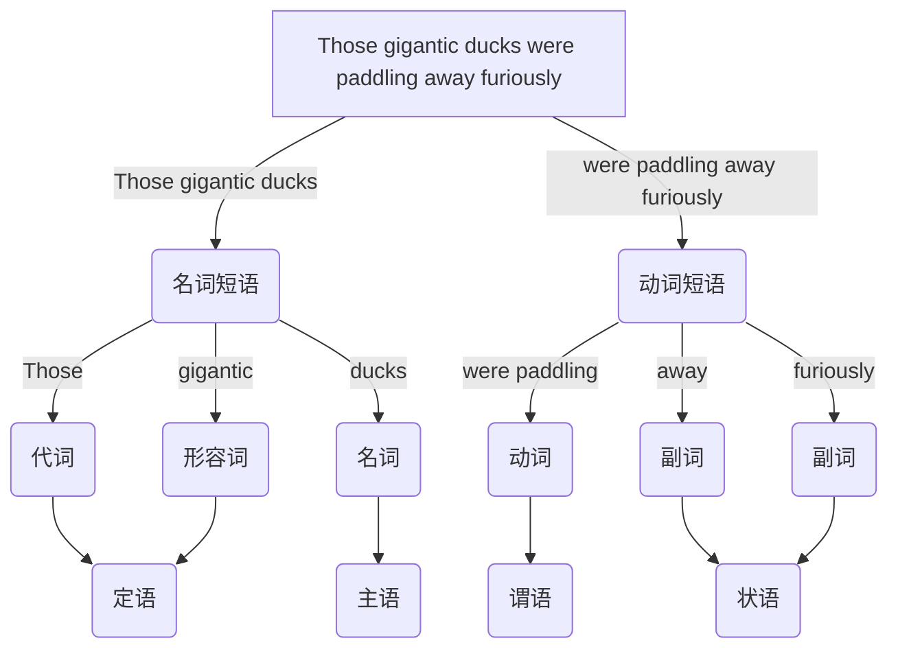

##### 英语说明
- 英语说明
	- 试图提供一个融洽的语法框架, 单词包压缩文件位于目录 `\笔记\人文社科\英语`

```mermaid
flowchart TD
	A[Those gigantic ducks were paddling away furiously ]
	A -->|Those gigantic ducks| B(名词短语)
	A -->|were paddling away furiously| C(动词短语)
	B -->|Those| D(代词)
	B -->|gigantic| E(形容词)
	B -->|ducks| F(名词)
	C -->|were paddling| G(动词)
	C -->|away| H(副词)
	C -->|furiously| I(副词)
	D --> J(定语)
	E --> J(定语)
	F --> K(主语)
	G --> L(谓语)
	H --> M(状语)
	I --> M(状语)
```

